# Exploring colour palettes
Stef Piatek  
`r format(Sys.time(), '%Y-%m-%d')`  

## Purpose

This is a quick reference to myself to choose colour palettes, these should colourblind-friendly
and ideally still discenable when printed in black and white. 

See the [exploring-colour-palettes.Rmd](exploring-colour-palettes.Rmd) script for the palettes used


## R Markdown


## Plotting 5 levels

Generally can choose any of these, best descrimination, current favourites are:

- palette_5
- jama
- jco
- Darjeeling
- Zissou
- OkabeIto


```
## [1] "default palette"
```

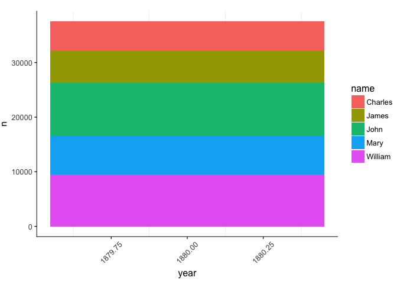<!-- -->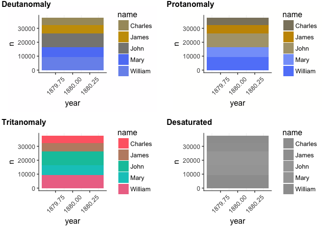<!-- -->

```
## [1] "palette_5"
```

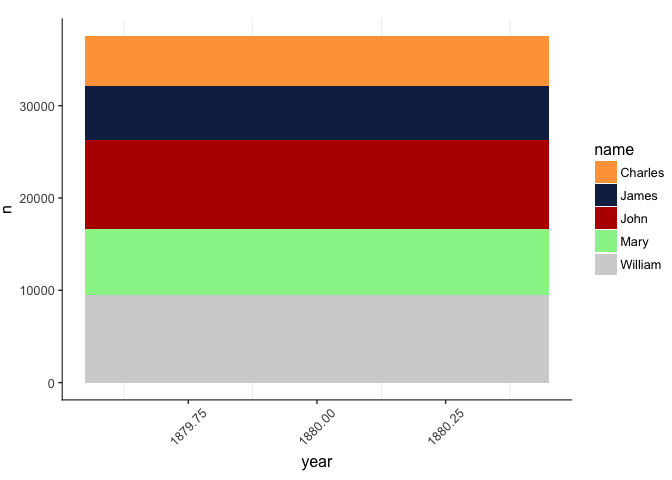<!-- --><!-- -->

```
## [1] "palette_18"
```

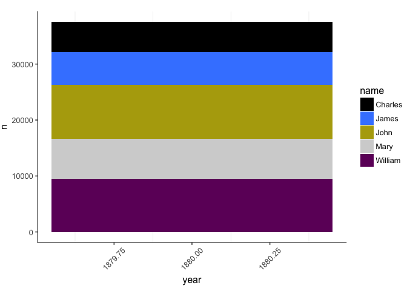<!-- -->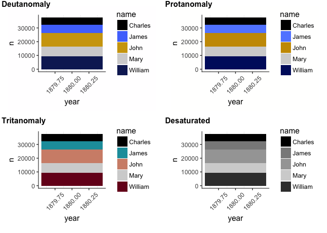<!-- -->

```
## [1] "nejm"
```

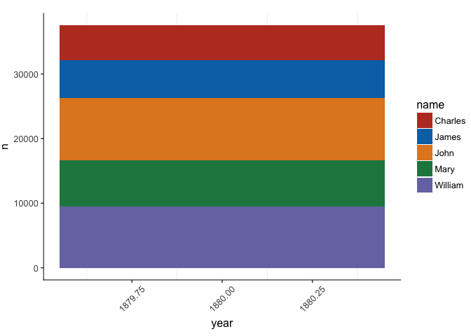<!-- -->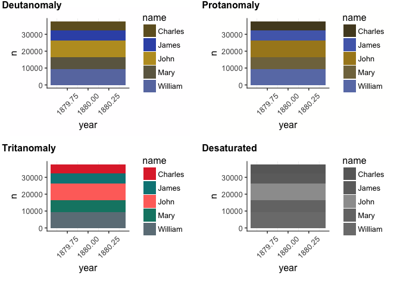<!-- -->

```
## [1] "jama"
```

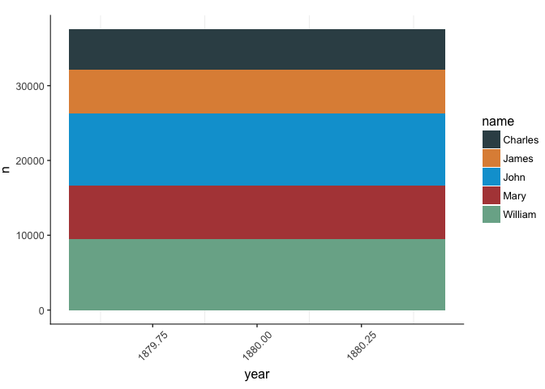<!-- -->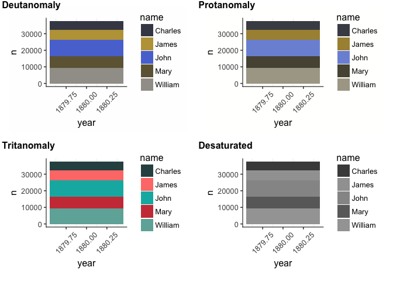<!-- -->

```
## [1] "jco"
```

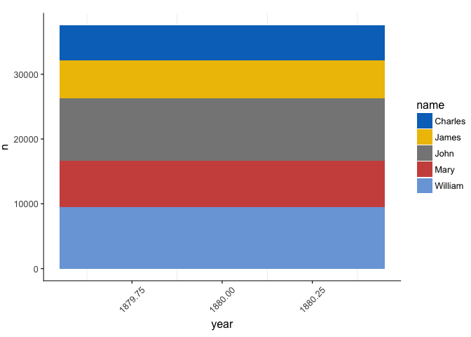<!-- -->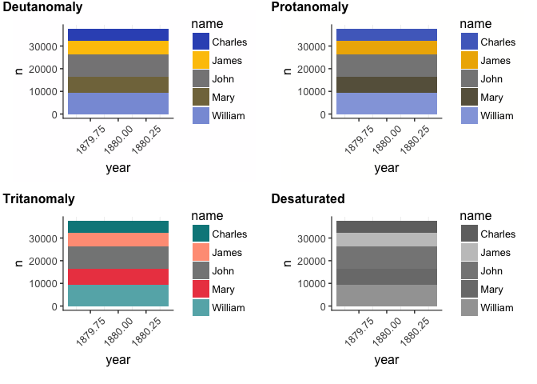<!-- -->

```
## [1] "igv"
```

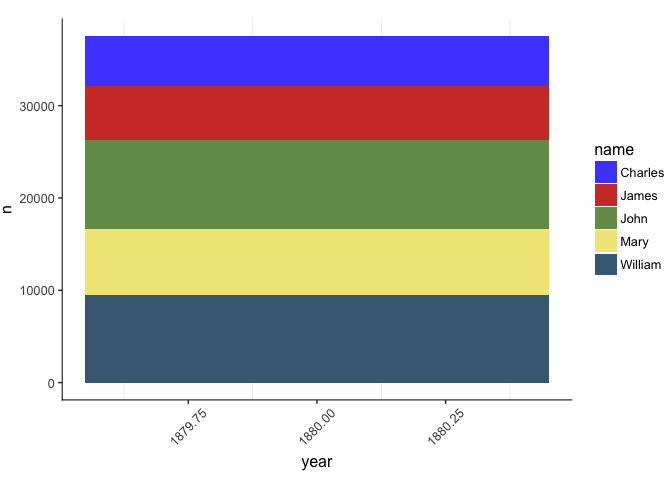<!-- -->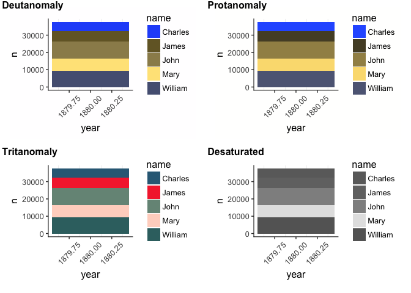<!-- -->

```
## [1] "Darjeeling"
```

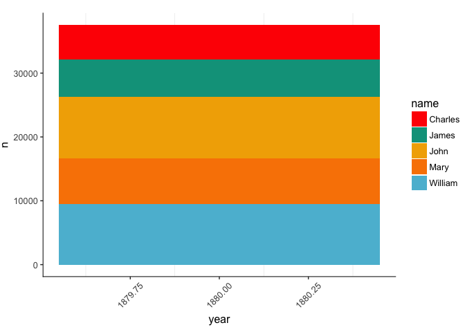<!-- -->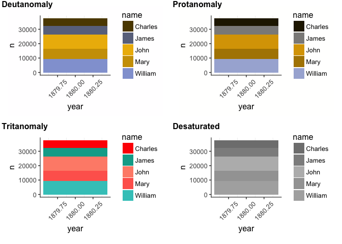<!-- -->

```
## [1] "Darjeeling2"
```

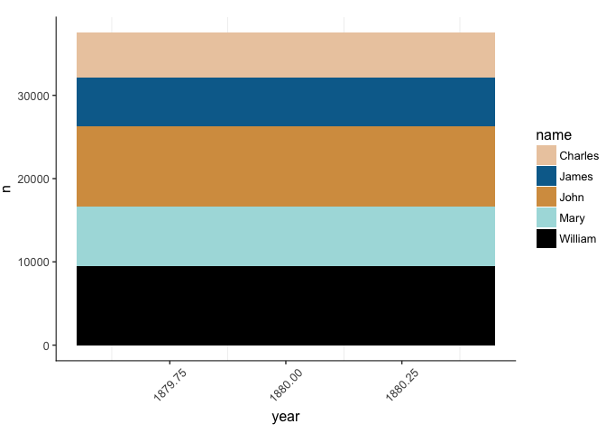<!-- -->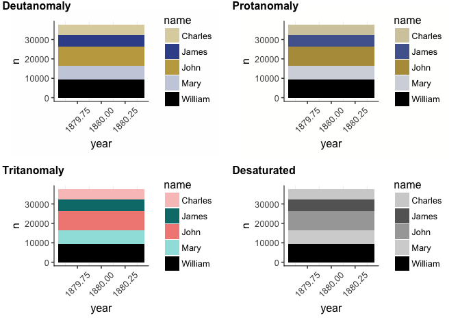<!-- -->

```
## [1] "Zissou"
```

<!-- -->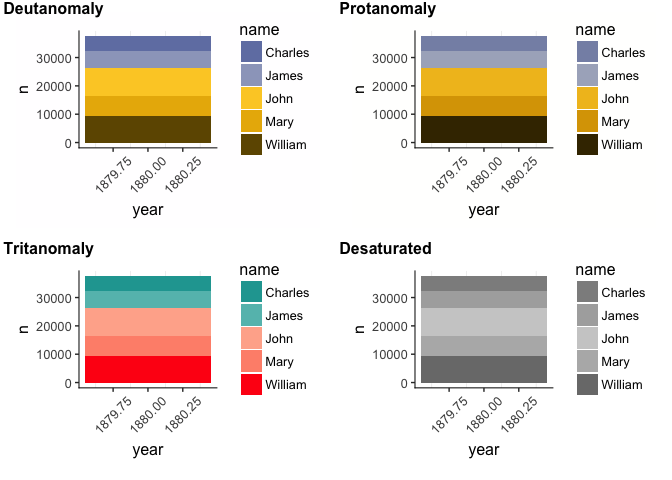<!-- -->

```
## [1] "OkabeIto"
```

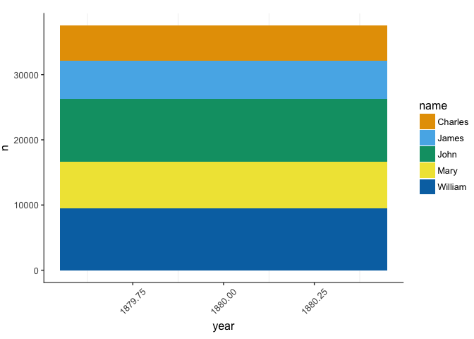<!-- -->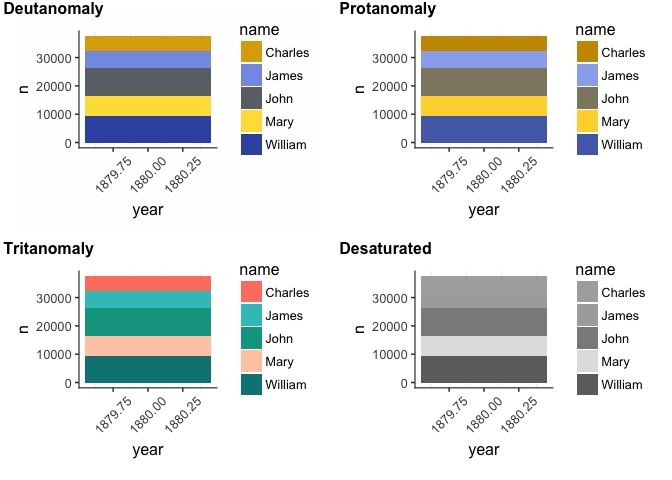<!-- -->
## Plotting 8 levels

More tricky, favourite here are:

- OkabeItoBlack
- OkabeIto
- palette_18
- igv


```
## [1] "default palette"
```

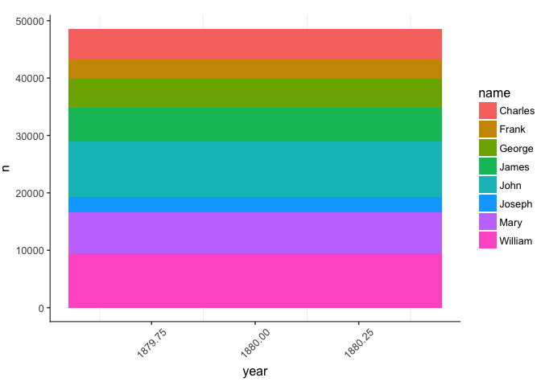<!-- -->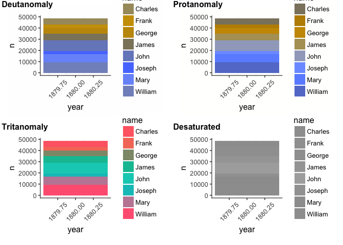<!-- -->

```
## [1] "palette_18"
```

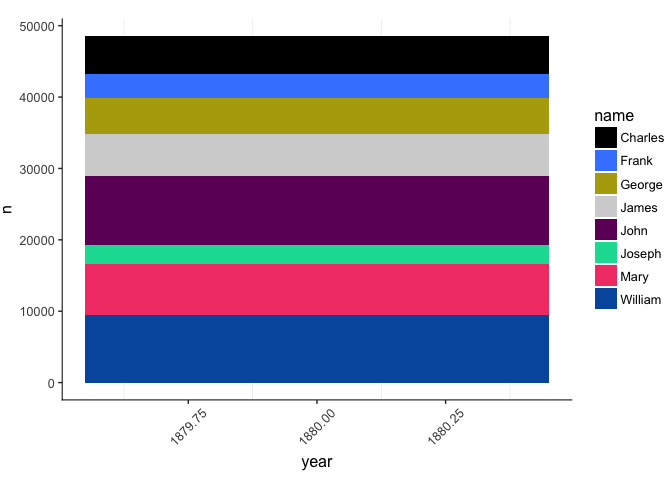<!-- -->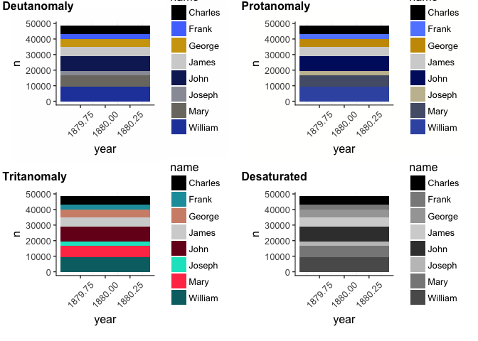<!-- -->

```
## [1] "jco"
```

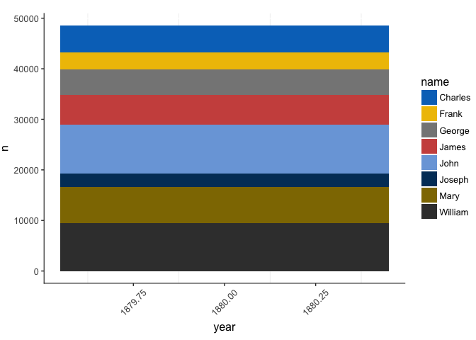<!-- -->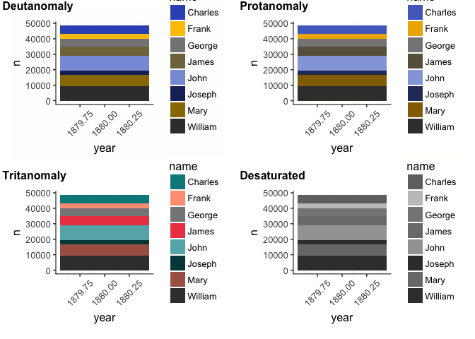<!-- -->

```
## [1] "igv"
```

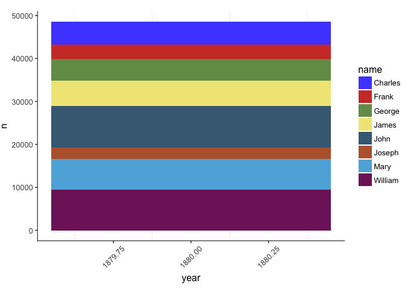<!-- -->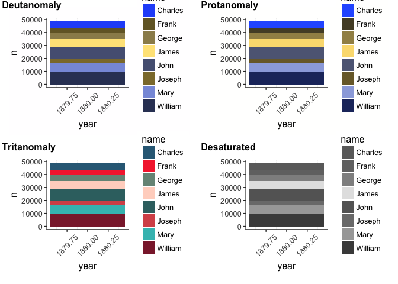<!-- -->

```
## [1] "OkabeIto"
```

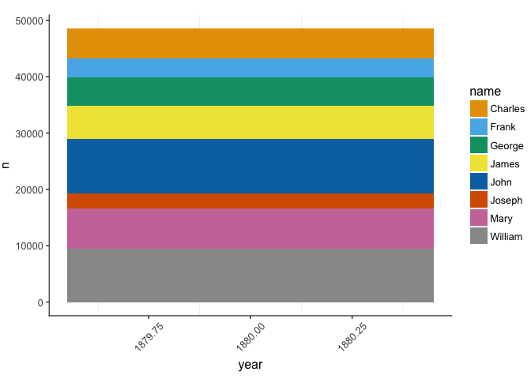<!-- -->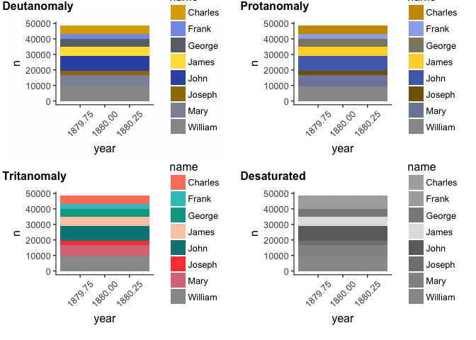<!-- -->

```
## [1] "OkabeIto black"
```

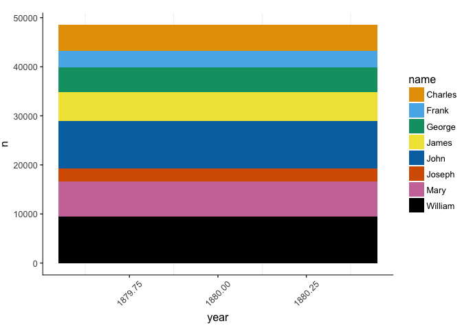<!-- --><!-- -->

