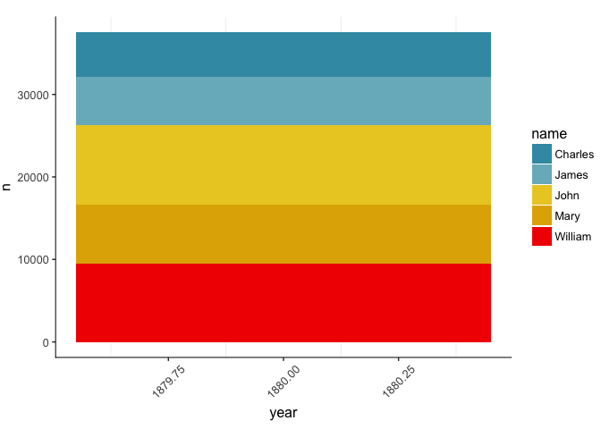

# Exploring colour palettes
Stef Piatek  
20 January 2018  

## Purpose

This is a quick reference to myself to choose colour palettes, these should colourblind-friendly
and ideally still discenable when printed in black and white. 

## Setup

```r
knitr::opts_chunk$set(echo = TRUE)
library(babynames)
library(dplyr)
```

```
## 
## Attaching package: 'dplyr'
```

```
## The following objects are masked from 'package:stats':
## 
##     filter, lag
```

```
## The following objects are masked from 'package:base':
## 
##     intersect, setdiff, setequal, union
```

```r
library(ggplot2)
library(colorblindr)
```

```
## Loading required package: colorspace
```

```r
library(wesanderson)
library(ggsci)

# set up ggplot theme and palettes 
theme_custom <- function (base_size = 12, base_family = "") {
  theme_bw(base_size = base_size, base_family = base_family) %+replace%
    theme(
      axis.line.x = element_line(color = "black"),
      axis.line.y = element_line(color = "black"),
      panel.border = element_blank(),
      legend.key = element_rect(fill = NA, colour = NA),
      panel.grid.minor.y = element_line(colour="white"),
      panel.grid.major = element_line(colour = "white"),
      axis.title.x=element_text(vjust=-1.5),
      plot.margin= unit(c(0.5, 0, 0.5, 0), "cm")# top right bottom left
    )
}
theme_set(theme_custom(base_size=12))

palette_5 <- c("#FFA347","#142952", "#B80000","#97F297", "#D3D3D3")

palette_18 <- c("#000000","#4286ff","#b3a80a","#D3D3D3","#6e0068","#01dca1","#f44575","#005aac","#f58037","#003888","#ff8868","#c492ff","#884600","#60004c","#d48267","#ff7ea9","#808080", "#5fe17a")
```

## R Markdown


## Plotting 5 levels

Generally can choose any of these, best descrimination, current favourites are:

- palette_5
- jama
- jco
- Darjeeling
- Zissou
- OkabeIto


```r
levels_5 <- babynames %>%
  group_by(year) %>%
  filter(year == 1880) %>%
    top_n(5, n)

plot_it <- function(data = NULL){
  plt <- ggplot(data) +
    geom_bar(stat = "identity", aes(x = year, y = n, fill = name)) +
    theme(axis.text.x  = element_text(angle=45, vjust=0.5))  
  
  return(plt)
}

## default palette
 
plt <- plot_it(levels_5)
plt
```

<!-- -->

```r
cvd_grid(plt)
```

<!-- -->

```r
## custom palette
plt <- plot_it(levels_5) +
  scale_fill_manual(values = palette_5)  
plt
```

<!-- -->

```r
cvd_grid(plt)
```

<!-- -->

```r
## custom palette
plt <- plot_it(levels_5) +
  scale_fill_manual(values = palette_18)  
plt
```

<!-- -->

```r
cvd_grid(plt)
```

<!-- -->

```r
## NEJM

plt <- plot_it(levels_5) +
  ggsci::scale_fill_nejm()  
plt
```

<!-- -->

```r
cvd_grid(plt)
```

<!-- -->

```r
## jama
plt <- plot_it(levels_5) +
  ggsci::scale_fill_jama()  
plt
```

<!-- -->

```r
cvd_grid(plt)
```

<!-- -->

```r
## jco
plt <- plot_it(levels_5) +
  ggsci::scale_fill_jco()  
plt
```

<!-- -->

```r
cvd_grid(plt)
```

<!-- -->

```r
## igv
plt <- plot_it(levels_5) +
  ggsci::scale_fill_igv()  
plt
```

<!-- -->

```r
cvd_grid(plt)
```

<!-- -->

```r
## Darjeeling
plt <- plot_it(levels_5) +
  scale_fill_manual(values = wes_palette("Darjeeling") ) 
plt
```

<!-- -->

```r
cvd_grid(plt)
```

<!-- -->

```r
## Darjeeling2
plt <- plot_it(levels_5) +
  scale_fill_manual(values = wes_palette("Darjeeling2") ) 
plt
```

<!-- -->

```r
cvd_grid(plt)
```

<!-- -->

```r
## Zissou
plt <- plot_it(levels_5) +
  scale_fill_manual(values = wes_palette("Zissou") ) 
plt
```

<!-- -->

```r
cvd_grid(plt)
```

<!-- -->

```r
## OkabeIto

plt <- plot_it(levels_5) +
  scale_fill_OkabeIto()
plt
```

<!-- -->

```r
cvd_grid(plt)
```

<!-- -->
## Plotting 8 levels

More tricky, favourite here are:

- OkabeItoBlack
- OkabeIto
- palette_18
- igv


```r
levels_8 <- babynames %>%
  group_by(year) %>%
  filter(year == 1880) %>%
    top_n(8, n)

## default palette
 
plt <- plot_it(levels_8)
plt
```

<!-- -->

```r
cvd_grid(plt)
```

<!-- -->

```r
## custom palette
plt <- plot_it(levels_8) +
  scale_fill_manual(values = palette_18)  
plt
```

<!-- -->

```r
cvd_grid(plt)
```

<!-- -->

```r
## jco
plt <- plot_it(levels_8) +
  ggsci::scale_fill_jco()  
plt
```

<!-- -->

```r
cvd_grid(plt)
```

<!-- -->

```r
## igv
plt <- plot_it(levels_8) +
  ggsci::scale_fill_igv()  
plt
```

<!-- -->

```r
cvd_grid(plt)
```

<!-- -->

```r
## OkabeIto

plt <- plot_it(levels_8) +
  colorblindr::scale_fill_OkabeIto()
plt
```

<!-- -->

```r
cvd_grid(plt)
```

<!-- -->

```r
## OkabeIto black

plt <- plot_it(levels_8) +
  scale_fill_manual(values = colorblindr::palette_OkabeIto_black)
plt
```

<!-- -->

```r
cvd_grid(plt)
```

<!-- -->

